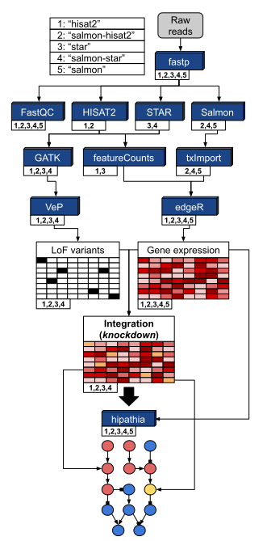

# Main inputs

## JSON

As explained by [the Workflow Description Language (WDL) authors](https://github.com/openwdl/wdl/blob/master/versions/development/SPEC.md#specifying-workflow-inputs-in-json), cromwell uses a [JSON](https://www.json.org/) formatted file as main input. In MIGNON, this file contains **absolute** paths to the files that are used during the analysis, **decision variables** to control which workflow steps are carried out (e.g. wether to perform or not the variant calling) and **arguments** to control each task execution (e.g. the amount of threads to use for the alignment).

Here you can find an example the content of a MIGNON input JSON file. To build your own input file, please go to the [**preparing the JSON**](#preparing-the-json) section.

```
{
    "MIGNON.execution_mode": "hisat2",
    "MIGNON.is_paired_end": true,
    "MIGNON.do_vc": true,
	"MIGNON.input_fastq_r1": [
		"flagForPwd/mignon_test_data/subset_fastq/SRR8615222_1.fastq.gz",
		"flagForPwd/mignon_test_data/subset_fastq/SRR8615223_1.fastq.gz",
		"flagForPwd/mignon_test_data/subset_fastq/SRR8615224_1.fastq.gz",
		"flagForPwd/mignon_test_data/subset_fastq/SRR8615225_1.fastq.gz"
	],
    "MIGNON.input_fastq_r2": [
		"flagForPwd/mignon_test_data/subset_fastq/SRR8615222_2.fastq.gz",
		"flagForPwd/mignon_test_data/subset_fastq/SRR8615223_2.fastq.gz",
		"flagForPwd/mignon_test_data/subset_fastq/SRR8615224_2.fastq.gz",
		"flagForPwd/mignon_test_data/subset_fastq/SRR8615225_2.fastq.gz"
	],
    "MIGNON.sample_id": [
        "Control_1",
        "Control_2",
        "Problem_1",
        "Problem_2"
    ],
    "MIGNON.group": [
        "Control",
        "Control",
        "Problem",
        "Problem"
    ],
    "MIGNON.gtf_file": "flagForPwd/mignon_test_data/Homo_sapiens.GRCh38.99.chr.gtf",
    "MIGNON.hisat2_index_path": "flagForPwd/mignon_test_data/hisat_index",
    "MIGNON.hisat2_index_prefix": "genome",
    "MIGNON.vep_cache_dir": "flagForPwd/mignon_test_data/subset_vep_cache",
    "MIGNON.ref_fasta": "flagForPwd/mignon_test_data/subset_genome.fa",
    "MIGNON.ref_fasta_index": "flagForPwd/mignon_test_data/subset_genome.fa.fai",
    "MIGNON.ref_dict": "flagForPwd/mignon_test_data/subset_genome.dict",
    "MIGNON.db_snp_vcf": "flagForPwd/mignon_test_data/subset_variants.vcf.gz",
    "MIGNON.db_snp_vcf_index": "flagForPwd/mignon_test_data/subset_variants.vcf.gz.tbi",
    "MIGNON.known_vcfs":["flagForPwd/mignon_test_data/subset_variants.vcf.gz"],
    "MIGNON.known_vcfs_indices": ["flagForPwd/mignon_test_data/subset_variants.vcf.gz.tbi"],
    "MIGNON.edger_script": "flagForPwd/scripts/edgeR.r",
    "MIGNON.hipathia_script": "flagForPwd/scripts/hipathia.r"

}
```

## Cromwell configuration file

The configuration file tells cromwell how to handle and launch the jobs that make up the workflow. When executing a single job, it places the values from the WDL file in the appropiated position within the container engine command. For example, the `requested_memory` runtime input, which controls the memory that is allocated for the execution of the task, is passed to the `--memory` argument when using `docker run`. On the other hand, when executing the workflow on a HPC environment, the `requested_memory` runime input is used in the submission of the job with `sbatch --mem` (SLURM command). In addition, this file can control other top-level features of cromwell, as for example how the duplicated files are managed or **the number of parallel jobs that can be executed**. You can find more information and examples of the possible backends that can be configured through this file in the [cromwell documentation](https://cromwell.readthedocs.io/en/stable/Configuring/).

To run MIGNON, we have prepared two different configurations files. The first one, [`LocalWithDocker.conf`](https://github.com/babelomics/MIGNON/blob/master/configs/LocalWithDocker.conf), is prepared to run MIGNON locally using docker to execute the containerized software. The second one, [`SlurmAndSingularity.conf`](https://github.com/babelomics/MIGNON/blob/master/configs/SlurmAndSingularity.conf), is intended to be used within HPC environments that use [Slurm](https://slurm.schedmd.com/documentation.html) as workload manager and have [Singularity](https://sylabs.io/docs/) installed as a module to run the containerized software.

# Execution modes

There are 5 different execution modes of MIGNON. Each of them makes use of a different combination of tools in the intial steps of the workflow. For example, the "salmon-hisat2" execution mode uses [HISAT2](http://www.ccb.jhu.edu/software/hisat/index.shtml) to perform the alignment and [Salmon](https://combine-lab.github.io/salmon/) to perform the gene expression quantification from reads. The HISAT2 alignments can then be used to run the variant calling (VC) sub-workflow with [GATK](https://gatk.broadinstitute.org/hc/en-us) to obtain the genomic information. Each mode has a specific computational profile and it should be selected depending on the user needs. In a nutshell, on modes where [STAR] (https://github.com/alexdobin/STAR) is used, the maximum memory requirements and velocity of the alignment are high. On the other hand, on modes where [HISAT2](http://www.ccb.jhu.edu/software/hisat/index.shtml) is used the memory requirements and velocity of alignments are lower, allowing more parallel jobs for the same computational price. The following table summarizes the basic properties of each execution mode:

| Execution mode  | Alignment | Quantification | Allows VC |
|-----------------|-----------|----------------|-----------|
| "salmon-hisat2" | HISAT2    | Salmon         | Yes       |
| "salmon-star"   | STAR      | Salmon         | Yes       |
| "hisat2"        | HISAT2    | featureCounts  | Yes       |
| "star"          | STAR      | featureCounts  | Yes       |
| "salmon"        | -         | Salmon         | No        |

In addition, the following figure shows which steps of the workflow are carried out under each execution mode:



**Depending on the execution modes, the required values in the input JSON can change**. We strongly recommend to use the combined execution modes “salmon-star” or “salmon-hisat2”, as they use the pseudo-alignment strategy to quantify gene expression dealing with the multi-mapping reads problem, and star or hisat2 to obtain the alignments for the variant calling sub-workflow. 

# Preparing the JSON

As explained before, the JSON file is used to store and register the file paths, workflow variables and execution parameters. For MIGNON, the values that should be included in this file can be divided in two different categories: [Required values](#required-values) and [default values](#default-values).

## Required values

The values detailed in this section are mandatory and will vary depending on the execution mode. Apart from the input reads or sample ids, it is important to pay attention to the different reference material that is required to perform the alignment, pseudo-alignment or variant calling as for example the aligner (HISAT2/STAR) indexes or the reference genome. The following table contains the basic information about each value, the execution modes where it is required and its description. The "preferred source" column details the source for the reference material that was used for running the workflow.

| Input               | Required at                                     | Variable type | File format | Description                                                                                                                                                                                                                                                  | Preferred source                                                                                                      |
|---------------------|-------------------------------------------------|---------------|-------------|--------------------------------------------------------------------------------------------------------------------------------------------------------------------------------------------------------------------------------------------------------------|-----------------------------------------------------------------------------------------------------------------------|
| is_paired_end       | All                                             | Boolean       | -           | Are input reads paired-end?                                                                                                                                                                                                                                  | -                                                                                                                     |
| input_fastq_r1      | All                                             | Array[File]   | fastq       | Array of paths indicating the location of the fastq files to be processed. If paired-end, the path to the (_1) files.                                                                                                                                        | -                                                                                                                     |
| input_fastq_r2      | All                                             | Array[File]   | fastq       | If paired-end, the path to the (_2) files. The position of each element in the array should match its pair in the input_fastq_r1 variable.                                                                                                                   | -                                                                                                                     |
| sample_id           | All                                             | Array[String] | -           | Array of sample identifiers. Those identifiers will be used across the different tasks to the pipeline to identify each input sample. The position of each element in the array should match its pair in the input_fastq_r1 variable.                        | -                                                                                                                     |
| group               | All                                             | Array[String] | -           | Array of string indicating the group of samples for each read file. Those groups will be used to perform the differential expression and signaling analyses. The position of each element in the array should match its pair in the input_fastq_r1 variable. | -                                                                                                                     |
| execution_mode      | -                                               | String        | -           | String indicating the execution mode to be used.                                                                                                                                                                                                             | -                                                                                                                     |
| do_vc               | "salmon-star", "salmon-hisat", "hisat2", "star" | Boolean       | -           | Perform the variant calling? Only in case users do not want to extract and use variants from RNA-Seq data.                                                                                                                                                   | -                                                                                                                     |
| gtf_file            | All                                             | File          | gtf         | Annotation file for the genome used at alignment and variant calling. It is also the input to create the transcript-to-gene file neccesary for the salmon quantifications.                                                                                   | [ENSEMBL](ftp://ftp.ensembl.org/pub/release-99/gtf/homo_sapiens/Homo_sapiens.GRCh38.99.gtf.gz)                        |
| ref_fasta           | "salmon-star", "salmon-hisat", "hisat2", "star" | File          | fasta       | Reference genome used to perform the variant calling.                                                                                                                                                                                                        | [ENSEMBL](ftp://ftp.ensembl.org/pub/release-99/fasta/homo_sapiens/dna/Homo_sapiens.GRCh38.dna.primary_assembly.fa.gz) |
| ref_fasta_index     | "salmon-star", "salmon-hisat", "hisat2", "star" | File          | fai         | Reference genome index used to perform the variant calling.                                                                                                                                                                                                  | Created from ref_fasta with samtools                                                                                  |
| ref_dict            | "salmon-star", "salmon-hisat", "hisat2", "star" | File          | dict        | Reference genome dictionary used to perform the variant calling.                                                                                                                                                                                             | Created from ref_fasta with samtools                                                                                  |
| db_snp_vcf          | "salmon-star", "salmon-hisat", "hisat2", "star" | File          | vcf         | Database of SNPs used to perform the variant calling.                                                                                                                                                                                                        | [NCBI](https://ftp.ncbi.nih.gov/snp/organisms/human_9606_b150_GRCh38p7/VCF/All_20170710.vcf.gz)                       |
| db_snp_vcf_index    | "salmon-star", "salmon-hisat", "hisat2", "star" | File          | tbi         | SNP database index.                                                                                                                                                                                                                                          | [NCBI](https://ftp.ncbi.nih.gov/snp/organisms/human_9606_b150_GRCh38p7/VCF/00-common_all.vcf.gz.tbi)                  |
| known_vcfs          | "salmon-star", "salmon-hisat", "hisat2", "star" | Array[File]   | vcf         | Databases of INDELs used to perform the variant calling.                                                                                                                                                                                                     | [NCBI](https://ftp.ncbi.nih.gov/snp/organisms/human_9606_b150_GRCh38p7/VCF/All_20170710.vcf.gz)                       |
| known_vcfs_indices  | "salmon-star", "salmon-hisat", "hisat2", "star" | Array[File]   | tbi         | INDEL databases indices.                                                                                                                                                                                                                                     | [NCBI](https://ftp.ncbi.nih.gov/snp/organisms/human_9606_b150_GRCh38p7/VCF/00-common_all.vcf.gz.tbi)                  |
| vep_cache_dir       | "salmon-star", "salmon-hisat", "hisat2", "star" | String        | -           | Path to the vep cache directory containing the variant annotations to be used. Should contain the SIFT and PolyPhen scores.                                                                                                                                  | [ENSEMBL](ftp://ftp.ensembl.org/pub/release-99/variation/indexed_vep_cache/)                                          |
| hisat2_index_path   | "salmon-hisat", "hisat2"                        | String        | -           | Path to the directory where the HISAT2 index is stored.                                                                                                                                                                                                      | Created from ref_fasta with HISAT2                                                                                    |
| hisat2_index_prefix | "salmon-hisat", "hisat2"                        | String        | -           | HISAT2 index prefix.                                                                                                                                                                                                                                         | -                                                                                                                     |
| star_index_path     | "salmon-star", "star"                           | String        | -           | Path to the directory where the STAR index is stored.                                                                                                                                                                                                        | Created from ref_fasta with STAR                                                                                      |
| salmon_index_path   | "salmon", "salmon-star", "salmon-hisat2"        | String        | -           | Path to the directory where the Salmon index is stored.                                                                                                                                                                                                      | Created from ref_fasta with Salmon                                                                                    |
| edger_script        | All                                             | File          | -           | Script executed in the EdgeR task.                                                                                                                                                                                                                           | Included in MIGNON                                                                                                    |
| tximport_script     | "salmon", "salmon-star", "salmon-hisat2"        | File          | -           | Script executed in the TxImport task.                                                                                                                                                                                                                        | Included in MIGNON                                                                                                    |
| hipathia_script     | All                                             | File          | -           | Script executed in the hiPathia task.                                                                                                                                                                                                                        | Included in MIGNON                                                                                                    |
| ensemblTx_script    | "salmon", "salmon-star", "salmon-hisat2"        | File          | -           | Script executed in the ensembldb task. It transforms the provided GTF into a Tx2Gene file used by tximport.                                                                                                                                                  | Included in MIGNON                                                                                                    |

## Default values

Some inputs have a default value that can be (or not) modified by users. This section comprises different type of inputs, from those able to modify the threads and memory used by the different softwares that make up the pipeline, to default values that are used in the multi-omic integrative.

### Execution values

As mentioned, some of the default values have the ability to modify the computational resources that every software uses to carry out a particular task within the workflow. In this group we have mainly three types of values: **cpu**, **mem** and **additional_parameters**. The **cpu** value is placed in the proper position on each command of the workflow, to modify, when possible, the number of threads used by the tool that is used in the task. **mem** indicates the amount of memory that is allocated to the execution of this task. Finally, **additional_parameters** allow users to include additional options for the execution of some tools within the workflow. All the execution inputs are defined with the same structure:

*nameOfTheTask*_*value*

And can be found in the following list.

```
Int? fastp_cpu = 1
String? fastp_mem = "16G"
String? fastp_additional_parameters = ""
Int? fastqc_cpu = 1
String? fastqc_mem = "16G"
String? fastqc_additional_parameters = ""
Int? hisat2_cpu = 1
String? hisat2_mem = "16G"
String? hisat2_additional_parameters = ""
Int? sam2bam_cpu = 1
String? sam2bam_mem = "16G"
String? sam2bam_additional_parameters = ""
Int? star_cpu = 1
String? star_mem = "32G"
String? star_additional_parameters = ""
Int? salmon_cpu = 1
String?  salmon_mem = "16G"
String? salmon_additional_parameters = ""
Int? featureCounts_cpu = 1
String? featureCounts_mem = "16G"
String? featureCounts_additional_parameters = ""
Int? vep_cpu = 1
String? vep_mem = "16G"
Int? ensemblTx_cpu = 1
String? ensemblTx_mem = "16G"
Int? edger_cpu = 1
String? edger_mem = "16G"
Int? tximport_cpu = 1
String? tximport_mem = "16G"
Int? hipathia_cpu = 1
String? hipathia_mem = "16G"
Int? filterBam_cpu = 1
String? filterBam_mem = "16G"
String? filterBam_additional_parameters = ""
```

As an example, to modify the execution of STAR, users can indicate threads, memory and include additional arguments by including the following lines in the input JSON.

```
"MIGNON.star_cpu": 4,
"MIGNON.star_mem": "64G",
"MIGNON.star_additional_parameters": "--limitBAMsortRAM 60359738368 --runRNGseed 333"
```

In addition to these, the **haplotype_scatter_count** value requires a special mention. As explained in the advanced section, this parameter allows users to apply the [scatter and gather strategy](https://gatk.broadinstitute.org/hc/en-us/articles/360035532012-Parallelism-Multithreading-Scatter-Gather) to parallelize the **GATK HaplotypeCaller** sub-task. This input will determine the number of chunks in which the reference genome is divide to perform the variant calling from aligned reads.

### Other values

Finally, there are some default values that are used to filter annotated variants and to perform the *in silico* knockdown of genes that are affected by those. Additionally, there are additional defaults that are required to perform some of the tasks but that do not have an impact in the output. All of them can be found in the following section.

```
# normalization and values
String? salmon_library_type = "A"
Int? edger_min_counts = 15  
Boolean? hipathia_normalize = true    
Float? hipathia_ko_factor = 0.01    
Float vep_sift_cutoff = 0.05
Float vep_polyphen_cutoff = 0.95    

# other values
File? tx2gene_file    
String? rg_platform = "Unknown"
String? rg_center = "Unknown"
Int? min_confidence_for_variant_calling 
File? ref_gz_index
File? intervals
File? input_bai
```

Those that actually have an impact on the output of the pipeline are detailed in the following table:

| Input               | Variable type | Default value | Description                                                                                                                                                                                                                                                                                                                                  |
|---------------------|---------------|---------------|----------------------------------------------------------------------------------------------------------------------------------------------------------------------------------------------------------------------------------------------------------------------------------------------------------------------------------------------|
| salmon_library_type | String        | A             | Library type for salmon quantification. Defaults to "A" (automatic detection).                                                                                                                                                                                                                                                               |
| edger_min_counts    | Int           |            15 | Minimum counts per gene. This parameter will be used to filter the count matrix before the differential expression analysis. By default, all those genes with less than 15 counts across all samples will be filtered.                                                                                                                       |
| hipathia_normalize  | Boolean       | "true"        | Normalize circuit pathway activity by length? HiPathia applies a signal propagation algorithm across the different receptor-effector circuits in the pathways to calculate the signaling circuit activity. The topology and diameter of such circuits influence the resulting circuit activity values, so this normalization is recommended. |
| hipathia_ko_factor  | Float         | 0.01          | LoF variants knockdown factor. This parameter control the number by which the normalized expression values are multiplied when a loss of function (LoF) variant is detected for a gene/sample.                                                                                                                                               |
| vep_sift_cutoff     | Float         | 0.05          | Sift cutoff value. In combination with **vep_polyphen_cutoff**, it is used to filter variants that will be considered as deleterious (LoF).                                                                                                                                                                                                  |
| vep_polyphen_cutoff | Float         | 0.95          | Polyphen cutoff value. In combination with **vep_sift_cutoff**, it is used to filter variants that will be considered as deleterious (LoF).                                                                                                                                                                                                  |

For more information about the integrative strategy that is performed in MIGNON, please read the article that accompanies this software.