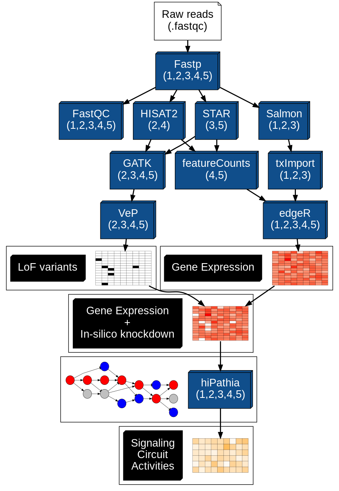

# Execution modes

Regarding the execution of the workflow, as explained in the **tool manuscript**, we have designed 5 execution modes that make use of different tools in crucial steps of the workflow: 

| Execution mode  | Alignment | Quantification | Allows variant calling | Computational profile                        |
|-----------------|-----------|----------------|------------------------|----------------------------------------------|
| "salmon-hisat2" | HISAT2    | Salmon         | Yes                    | Low memory consumption. Slower than STAR.    |
| "salmon-star"   | STAR      | Salmon         | Yes                    | High memory consumption. Faster than HISAT2. |
| "hisat2"        | HISAT2    | featureCounts  | Yes                    | Low memory consumption. Slower than STAR.    |
| "star"          | STAR      | featureCounts  | Yes                    | High memory consumption. Faster than HISAT2. |
| "salmon"        | -         | Salmon         | No                     | Low memory consumption and fast.             |

We strongly recommend to use the combined execution modes “salmon-star” or “salmon-hisat2”, as they use the pseudo-alignment strategy to quantify gene expression dealing with the multi-mapping reads problem, and star or hisat2 to obtain the alignments for the variant calling sub-workflow. 

The following figure exemplifies the different execution modes, as well as the tools used in each of them, being: 1) “salmon”, 2) “salmon-hisat2”, 3) “salmon-star”, 4) “hisat2”, 5) “star”.

# Parallelization

MIGNON does not implement an engine to parallelize the tasks. Instead, it relies on the intrinsic ability of each tool to use multi-threading and in the ability of [cromwell](https://github.com/broadinstitute/cromwell) to launch a number of parallel jobs through the **concurrent-job-limit** parameter of the [config file](https://github.com/babelomics/MIGNON/tree/master/configs). We encourage users to read [cromwell parallelism post](Parallelism-Multithreading-Scatter-Gather), as it depicts the levels at which the execution of a workflow can be done in parallel. Overall, there are two levels at which MIGNON allows the use of parallel executions:

## Parallel jobs

### Sample-level

This is, the number of parallel tasks that can be executed using the task dependency tree created by cromwell. For example, the **fastp** processing of each sample is a task that can be easily executed in parallel. Multiple samples can be processed at the same time as they do not depend on each other's outputs. On the other hand, tasks as **featureCounts** require a bunch of outputs and will not start until all the alignments finish successfully. This parallelization at sample level, when allowed, is controlled through the **concurrent-job-limit** parameter in the cromwell configuration file. As calculating the number of concurrent jobs is not a straightforward task, and will depend entirely on the workflow structure, **we recommend to limit this parallelization level to one when deploying the workflow in machine with limited computational resources** (i.e 32 Gb of memory). On the other hand, if using HPC or Cloud Computing, this level allows to significantly reduce the workflow execution time.

### Scatter-gather strategy for HaplotypeCaller

As explained in the **input** section, there is an input parameter (**haplotype_scatter_count**) that allows using the [scatter and gather strategy](https://gatk.broadinstitute.org/hc/en-us/articles/360035532012-Parallelism-Multithreading-Scatter-Gather) for the **GATK HaplotypeCaller** sub-task. This parameter can be used to speed up the variant calling process and will split the single-sample variant calling into a number of parallel processes. As the variant calling is carried out at sample-level, if this parameter is set to 5, MIGNON will create 5 sub-tasks for each sample that will considerably speed up the HaplotypeCaller execution time.

## Multi-thread tools

For those tools that allow multi-threading, we have included workflow-level inputs that are directly passed to the tool parameter that control such multi-threading. Additionally, for those tasks, we have performed a study of the performance of the tools under 6 different CPU configurations, which are depicted in the **workflow manuscript**. In brief, tools that allow multi-threading considerably speed up in correlation with the the number of CPUs. However, in our opinion, from 8 cpus up, the reduction on execution time is not worth for the number of CPUs used.