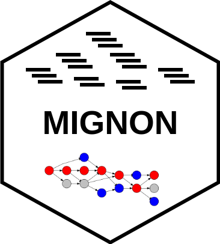

# MIGNON

**Mechanistic InteGrative aNalysis Of rNa-seq data**

This repository contains all the neccesary code to execute **MIGNON**, a bioinformatic workflow for the analysis of RNA-Seq data capable of integrating genomic and transcriptomic information into mechanistic signaling circuits. It covers the whole process using state-of-the-art tools and is deployable in under different computational environments. By using an in-silico knockdown strategy, it calculates the signaling circuit activities from gene expression and genomic variants using raw reads as input.

## Dependencies

1. [Docker](https://www.docker.com/). To execute all the containerized software.
2. [Java (v1.8.0)](https://java.com/en/download/help/download_options.xml). To use cromwell.
3. [Cromwell](https://github.com/broadinstitute/cromwell/releases). To interpret and execute the workflow.

## Quick Start

```
git clone https://github.com/babelomics/MIGNON.git

cd MIGNON

bash example_run.sh
```

For more information about how the execution parameters of MIGNON, please visit the [MIGNON TUTORIAL](https://babelomics.github.io/MIGNON/tutorial.html).