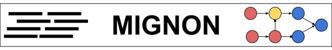

[](https://babelomics.github.io/MIGNON/)

[](https://travis-ci.com/babelomics/MIGNON)

_**M**echanistic **I**nte**G**rative a**N**alysis **O**f r**N**a-seq data_

This repository contains all the necessary code to execute **MIGNON**, a bioinformatic workflow for the analysis of RNA-Seq capable of integrating genomic and transcriptomic data into mechanistic signaling circuits. It covers the whole process using state-of-the-art tools and is deployable in under different computational environments. By using an *in-silico* knockdown strategy, it calculates the signaling circuit activities from gene expression and loss-of-function variants using raw reads as input. It is written using the [Workflow Description Language (WDL)](https://github.com/openwdl/wdl) and can be executed using [cromwell](https://github.com/broadinstitute/cromwell) and [docker](https://www.docker.com/) (or other engine able to run docker containers). For more information about **MIGNON**, please visit the documentation:

[**Link to MIGNON documentation**](https://babelomics.github.io/MIGNON/)

## Dependencies

1. [Docker](https://www.docker.com/).
2. [Java (v1.8.0)](https://java.com/en/download/help/download_options.xml).
3. [Cromwell](https://github.com/broadinstitute/cromwell/releases).

## Quick start

Users with experience on workflow managers and containers can directly clone and execute the dry run of the workflow if they already have [Git](https://git-scm.com/), [Java (v1.8.0)](https://www.java.com/es/download/) and [docker](https://www.docker.com/) installed. This can be done by executing the following commands on your terminal:

```
git clone https://github.com/babelomics/MIGNON.git
cd MIGNON
bash runMignonExample.sh
```

After completing the dry runs, the results of the pipeline can be found at the `dry_run/cromwell-executions` directory. 

## Citation

If you use this software, please cite:


