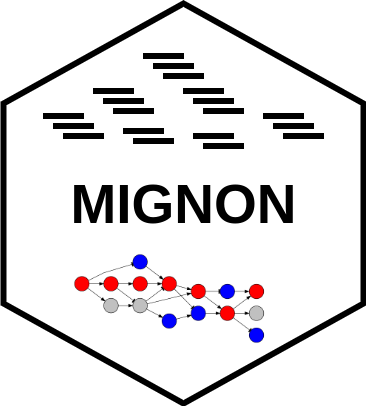

# Home

Welcome to MIGNON's documentation!

1. [Installation](installation.md)
2. [Input](input.md)
3. [Execution modes](execution_modes.md)
4. [Output](output.md)
5. [Parallelization](parallelization.md)

# About

MIGNON is a bioinformatic workflow for the mechanistic integrative analysis of RNA-seq data. It is written using the [Workflow Description Language (WDL)](https://github.com/openwdl/wdl) and can be executed using [Cromwell](https://github.com/broadinstitute/cromwell). It implements a novel way of analyzing RNA-Seq data, extracting the transcriptomic and genomic information obtainable from RNA-Seq reads. By using a *in-silico* knockdown strategy, it estimates the cellular signaling circuits activities through the application of the [hiPathia](http://hipathia.babelomics.org/) model, using gene expression as a proxy of protein signaling activity.
