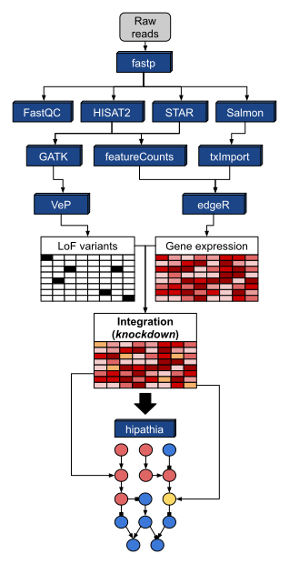

# **M**echanistic **I**nte**G**rative a**N**alysis **O**f r**N**a-seq data

## What is MIGNON?

**MIGNON** is a bioinformatic workflow for the analysis of RNA-Seq experiments, which not only efficiently manages the estimation of gene expression levels from raw reads, but also calls genomic variants present in the transcripts analyzed. Moreover, this is the first workflow that provides a framework for the integration of transcriptomic and genomic data based on a mechanistic model of signaling pathway activities. The main output of MIGNON are the predicted activity values of this model, that provides a detailed biological interpretation of the results, including a comprehensive functional profiling of cell activity. MIGNON covers the whole process, from reads to signaling circuit activity estimations, using state-of-the-art tools, it is easy to use and is deployable in different computational environments, allowing an optimized use of the resources available. 

## What can I get from MIGNON?

**MIGNON** can help you to get the most out of your RNA-Seq data. It is ready to squeeze all the gene-level information that can be retrieved from raw reads, delivering an integrated output that is directly interpretable by researchers in a very intuitive approach. With MIGNON, you can answer some questions such as:

* Which pathways are up or down regulated in response to the stimulus?
* Does the **gene X** have a loss of function variant in the **sample Y** at the RNA level?
* Is the expression of **gene X** altered in response to the stimulus?
* How do the pathway level results change if the genomic information is not included?

## Who can use MIGNON?

Everyone! MIGNON is freely available in the following repository under the MIT license:

* [----> **Link to MIGNON repository** <----](https://github.com/babelomics/MIGNON/)

To install and use MIGNON, please visit the [installation page](1_installation.md). In addition, if users want to provide feedback about the workflow, we encourage them to use the [issues](https://github.com/babelomics/MIGNON/issues) section in the GitHub repository.

## How does it work?

MIGNON initial steps are composed by state-of-the art methods to perform the quality control, alignment (or pseudo-alignment), quantification, gene expression normalization and variant calling and annotation. On the other hand, the end of the workflow is composed by several scripts that integrate transcriptomic and genomic information, and apply the [hipathia](http://hipathia.babelomics.org/) signal propagation algorithm to extract the signaling circuit activities. The following image summarizes all the steps that can be carried out during the execution of the pipeline:

## Who developed MIGNON and what is the purpose of it?

MIGNON is the product of an active development and maintenance carried out by researchers from the [Clinical Bioinformatics Area](http://www.clinbioinfosspa.es/), the [Maimonides Biomedical Research Institute of Cordoba](https://www.imibic.org/) and the [University of Cordoba](http://www.uco.es/). It was developed with the purpose of stablishing the necessary bioinformatic structure to use the RNA-Seq data as a valuable asset in the personalized medicine field. With the plummeting in the costs of sequencing, and bringing together all the information that can be retrieved from this technique in the appropriated functional context, we hope to use this workflow within the clinical practice in a near future.